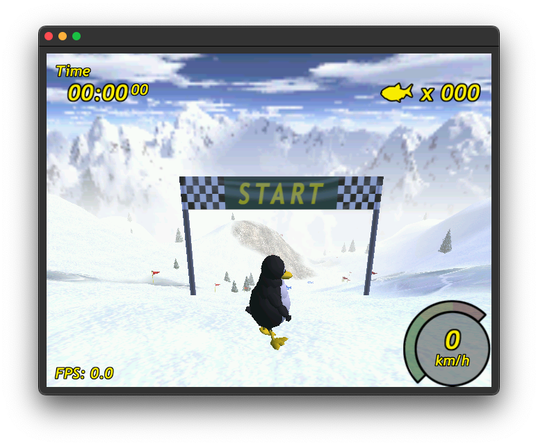

- [About this Project](#about-this-project)
- [Area Usage](#area-usage)
- [Working Games](#working-games)
- [Checkout Repository](#checkout-repository)
- [Platforms](#platforms)
- [How to integrate](#how-to-integrate)
  - [How to port the Driver](#how-to-port-the-driver)
  - [How to use the Core](#how-to-use-the-core)
- [Variant](#variant)

# About this Project
The RasterIX* project is a rasterizer implementation for FPGAs written in Verilog. It implements a OpenGL ES 1.1 (except fixed point functions) plus some OpenGL 1.3 additions, fixed-function pixel pipeline with up to two TMUs and register combiners in hardware. The vertex pipeline is implemented in software.

The renderer is able to produce __100 MPixels__ and __200 MTexels__ per second at a clock speed of 100 MHz.

The project began as an experiment to see how a 3D renderer could be implemented on an FPGA and has evolved into a core capable of rendering complex 3D scenes. The long-term goal of this project is to recreate an open-source fixed-function renderer compatible with OpenGL ES 1.1 and OpenGL 1.5, suitable for embedded devices such as microcontrollers or embedded Linux systems.

*The name RasterIX is an abbreviation of "Rasterizer 9", with the 9 referencing the end of the 1990s — a time when fixed-function renderers reached the peak of their popularity.

# Area Usage
With a typical configuration, the core requires __around 11k LUTs__ on a Xilinx Series 7 device: 
  - 64 bit memory bus
  - 256px textures
  - 1 TMU
  - mip mapping
  - depth buffer
  - stencil buffer
  - fog
  - texture filtering
  - RGB666
  - fix point interpolation with 25 bit multipliers
  - internal framebuffer (RasterIX_IF)

The core can blow up to __around 36k LUTs__ on a Xilinx Series 7 device when everything is enabled: 
  - 128 bit memory bus
  - 256px textures
  - 2 TMUs
  - mip mapping
  - depth buffer
  - stencil buffer
  - fog
  - texture filtering
  - RGB666
  - float interpolation with 32 bit floats
  - external frame buffer (RasterIX_EF)

A minimal configuration can get the utilization down to __around 4.5k LUTs__ on a Xilinx Series 7 device:
  - 32bit memory bus
  - 128px textures
  - 1 TMU
  - no mip mapping
  - no depth buffer
  - no stencil buffer
  - no fog
  - no texture filtering
  - RGB555
  - fix point interpolation with 25bit multipliers
  - internal framebuffer (RasterIX_IF)

Note: The float interpolation has the highest impact on the utilization and is usually not needed. Both configurations have the same behavior via the OpenGL API.

# Working Games
Tested games are [tuxracer](https://github.com/ToNi3141/tuxracer.git) (statically liked), [Quake 3 Arena](https://github.com/ToNi3141/Quake3e) with SDL2 and glX, Warcraft 3 with WGL and others.



The following video was recorded on an [Digilent ArtyZ7-20](/rtl/top/Xilinx/ArtyZ7-20/README.md) with an 1024x600px display running petalinux.
<video src="https://github.com/user-attachments/assets/909e6167-abf3-4c31-8bfd-f250dc2a8f0c" width="1024" height="500"></video>

# Checkout Repository
```sh
git clone --recurse-submodules https://github.com/ToNi3141/RasterIX.git
```

# Platforms
The rasterizer is running on the following platforms:

- [Verilator Simulation](/rtl/top/Verilator/README.md)
- [Digilent Nexys Video](/rtl/top/Xilinx/NexysVideo/README.md)
- [Digilent CMod7](/rtl/top/Xilinx/CmodA7/README.md)
- [Digilent ArtyZ7-20](/rtl/top/Xilinx/ArtyZ7-20/README.md)

# How to integrate
To integrate it into your own project, first have a look at the already existing platforms. If you want to integrate it in a already existing SoC system, you may have a look at the ArtyZ7. If you want to use it as standalone, have a look at the Nexys Video or CMod7.

The __pico-sdk__ and __PlatformIO__ are supported. See [Digilent CMod7](/rtl/top/Xilinx/CmodA7/README.md).

## How to port the Driver
To port the driver to a new interface (like SPI, async FT245, AXIS, or others) use the following steps:
1. Create a new class which is derived from the `IBusConnector`. Implement the virtual methods. This interface is used to interface the hardware via SPI, AXIS or what else.
2. Create a new class which is derived from the `IThreadRunner`. Implement the virtual methods or use one of the existing runners. This interface is used to offload work into a worker thread. Offloading has only an advantage on multi core systems. Single core systems will run slower. The `NoThreadRunner` can be used for all platforms. It does not create an additional thread. The `MultiThreadRunner` can be used for systems which implement `std::thread`. If you have another multi core system like the rppico, an own runner to utilize all cores must be implemented.
3. Set the build variables mentioned below in the table.
4. Add the whole `lib/gl`, `lib/3rdParty` and `lib/driver` directory to your build system. If a existing ThreadRunner is used, also add `lib/threadrunner`. If CMake is used, add this repository to your CMake project and include the library by adding `gl` (and `threadrunner` when using an existing runner).
5. Build

See also the example [here](/example/util/native/Runner.hpp).

The build system requires the following parameters to be set:

Note: Bold options are required to be equal to the hardware counterparts.

| Property                               | Description |
|----------------------------------------|-------------|
| __RIX_CORE_TMU_COUNT__                 | Number of TMUs the hardware supports. Must be equal to the FPGA configuration. |
| __RIX_CORE_MAX_TEXTURE_SIZE__          | The maximum texture resolution the hardware supports. A valid values is 256 for 256x256px textures. Must be the same value as in __MAX_TEXTURE_SIZE__ |
| __RIX_CORE_ENABLE_MIPMAPPING__         | Set this to `true` when mip mapping is available. Must be equal to the FPGA configuration |
| RIX_CORE_MAX_DISPLAY_WIDTH             | The maximum width if the screen. All integers are valid like 1024. To be most memory efficient, this should fit to your display resolution. |
| RIX_CORE_MAX_DISPLAY_HEIGHT            | The maximum height of the screen. All integers are valid like 600. To be most memory efficient, this should fit to your display resolution. |
| __RIX_CORE_FRAMEBUFFER_SIZE_IN_PIXEL_LG__ | The log2(size) of the framebuffer in pixel. For the `rixef` variant, use a value which fits at least the whole screen like log2(1024 * 600) + 1. For the `rixif` variant, use the same value configured in the FPGA. A valid value could be 16. |
| __RIX_CORE_USE_FLOAT_INTERPOLATION__   | If `true`, it uploads triangle parameters in floating point format. If `false`, it uploads triangle parameters in fixed point format. Must be equal to the FPGA configuration. |
| RIX_CORE_NUMBER_OF_TEXTURE_PAGES       | The number of texture pages available. Combined with TEXTURE_PAGE_SIZE, it describes the size of the texture memory on the FPGA. This must never exceed the FPGAs available memory. |
| RIX_CORE_NUMBER_OF_TEXTURES            | Number of allowed textures. Lower value here can reduce the CPU utilization. Typically set this to the same value as NUMBER_OF_TEXTURE_PAGES. |
| __RIX_CORE_TEXTURE_PAGE_SIZE__         | The size of a texture page in bytes. Typical value is 4096. |
| RIX_CORE_GRAM_MEMORY_LOC               | Offset for the memory location. Typically this value is 0. Can be different when the memory is shared with other hardware, like in the Zynq platform. |
| RIX_CORE_COLOR_BUFFER_LOC_0            | Location of the used framebuffer, when the RasterIX is off. On linux, usually the address of the buffer used for the fb dev. |
| RIX_CORE_COLOR_BUFFER_LOC_1            | Location of the first framebuffer. |
| RIX_CORE_COLOR_BUFFER_LOC_2            | Location of the second framebuffer. |
| RIX_CORE_DEPTH_BUFFER_LOC              | Location of the depth buffer (unused in `rixif`). |
| RIX_CORE_STENCIL_BUFFER_LOC            | Location of the stencil buffer (unused in `rixif`). |
| RIX_CORE_THREADED_RASTERIZATION        | Will disable the vertex transformation in the RIX lib. Instead it pushes untransformed triangles into the display list. A `ThreadedVertexTransformer` is required for vertex transforming before it is send to the FPGA. For the `rixif` config a `ThreadedVertexTransformer` is required. On multicore systems, it can drastically improve performance. |
| RIX_CORE_THREADED_RASTERIZATION_DISPLAY_LIST_SIZE | Sets the size of the display list. A good value is a size similar of `IDevice::requestDisplayListBuffer().size()`. Most of the times smaller lists are also working perfectly fine. |
| RIX_CORE_ENABLE_VSYNC                  | Enables vsync. Requires two framebuffers and a display hardware, which supports the vsync signals. |
| MAX_VBO_COUNT                          | Max usable VBOs (Vertex Buffer Objects). Default is 256. VBOs are used mainly for compatibility with OpenGL, but do not provide performance advantages in this driver. |
| RIX_CORE_PERFORMANCE_MODE              | Enables the performance mode which exchanges compatibility with performance optimizations. For instance, the intermediate display upload (where a frame is split in several display lists, when a display list overflows) will break on the `rixif` config, because the depth and stencil buffer are not reloaded. |

## How to use the Core
1. Add the files in the following directories to your project: `rtl/RasterIX/*`, `rtl/3rdParty/verilog-axi/*`, `rtl/3rdParty/verilog-axis/*`, `rtl/3rdParty/*.v`, and `rtl/Float/rtl/float/*`.
2. Instantiate the `RasterIX` module and configure it.
3. Connect the `s_cmd_axis` interface to your command stream (this is the output from the `IBusConnector`).
4. Connect the `m_mem_axi` interface to a memory.
5. Optionally connect `m_framebuffer_axis` to an device, which can handle the color buffer stream (a display for instance). When using a memory mapped framebuffer, then this port is unused.
6. Connect the framebuffer signals (`swap_fb`, `fb_swapped`, `fb_addr`, `swap_fb_enable_vsync`). They are used to signal an display controller, that it should swap the color buffer. `swap_fb` gets high when a swapping is requested, `fb_swapped` is used to signal that the swap request was executed and the new color buffer is used. `fb_addr` contains the address of the new color buffer. Optionally `swap_fb_enable_vsync` informs the framebuffer to use vsync if available. If the signals are not used, then connect them the following way: `assign fb_swapped = !swap_fb`. `fb_addr` and `swap_fb_enable_vsync` can be left unconnected.
7. Connect `resetn` to your reset line and `aclk` to your clock domain.
8. Synthesize.

The hardware has the following configuration options:

Note: Bold options are required to be equal to the software counterparts.

| Property                                  | Variant | Description |
|-------------------------------------------|---------|-------------|
| __VARIANT__                               | if/ef   | The selected variant. Valid values are `if` for the rixif and `ef` for the rixef. |
| ENABLE_FRAMEBUFFER_STREAM                 | if/ef   | Enables the streaming via the m_framebuffer_axis interface, and disables the swap_fb interface for memory mapped displays. |
| ENABLE_BLOCKING_STREAM                    | if/ef   | The m_frambuffer_axis stream is blocking. No rendering is started until the streaming is done. In this configuration, a single color buffer can be used. Otherwise a double buffer is required. |
| __FRAMEBUFFER_SIZE_IN_PIXEL_LG__          | if      | The size of the internal framebuffer (in power of two). <br> Depth buffer word size: 16 bit. <br> Color buffer word size: FRAMEBUFFER_SUB_PIXEL_WIDTH * (FRAMEBUFFER_ENABLE_ALPHA_CHANNEL ? 4 : 3). |
| FRAMEBUFFER_SUB_PIXEL_WIDTH               | if      | Sub pixel width in the internal framebuffer. |
| FRAMEBUFFER_ENABLE_ALPHA_CHANNEL          | if      | Enables the alpha channel in the framebuffer. |
| ENABLE_STENCIL_BUFFER                     | if/ef   | Enables the stencil buffer unit. Note: The stencil buffer has in the `rixif` 16 bit wide, in the `rixef` config only 8 bit. Consider the side difference in the stencil buffer address. |
| ENABLE_DEPTH_BUFFER                       | if/ef   | Enables the depth buffer unit. The depth buffer is 16 bit wide. |
| __TMU_COUNT__                             | if/ef   | Number of TMU the hardware shall contain. Valid values are 1 and 2. |
| __TEXTURE_PAGE_SIZE__                     | if/ef   | The page size of the texture memory. |
| __ENABLE_MIPMAPPING__                     | if/ef   | Enables the mip map unit. |
| __MAX_TEXTURE_SIZE__                      | if/ef   | Size of the texture buffer. Valid values: 256, 128, 64, 32. For instance, a 256 texture requires 256 * 256 * 2 bytes of FPGA RAM. Additional RAM is required when __ENABLE_MIPMAPPING__ is selected |
| ENABLE_TEXTURE_FILTERING                  | if/ef   | Enables the texture filter unit. |
| ENABLE_FOG                                | if/ef   | Enables the fog unit. |
| ADDR_WIDTH                                | if/ef   | Width of the AXI address channel. |
| ID_WIDTH                                  | if/ef   | Width of the AXI id property. Should be at least 4. |
| DATA_WIDTH                                | if/ef   | Width of the AXI data property. |
| STRB_WIDTH                                | if/ef   | Width of the AXI strobe property. Should always be 8 bit per byte. |
| __RASTERIZER_ENABLE_FLOAT_INTERPOLATION__ | if/ef   | `true` enables the floating point interpolation. `false` enables the fixed point interpolation. |
| RASTERIZER_FIXPOINT_PRECISION             | if/ef   | Defines the width of the multipliers used in the fixed point interpolation. Valid range: 16-25. |
| RASTERIZER_FLOAT_PRECISION                | if/ef   | Precision of the floating point arithmetic. Valid range: 20-32. |
| SUB_PIXEL_CALC_PRECISION                  | if/ef   | Precision of the sub pixel calculations in the shader and texture filter. Higher values will improve the image quality but also occupy more logic. Valid range: 5-8. |

# Variant
The core comes in two variants: `RasterIX_IF` and `RasterIX_EF`. `IF` stands for internal framebuffer, while `EF` stands for external framebuffer. Both variants have their advantages and drawbacks, but except for framebuffer handling and resulting limitations, they are functionally identical.

`RasterIX_IF`: This variant is usually faster because it loosely depends on the memory subsystem of your FPGA. Rendering is executed entirely in the FPGA's static RAM resources. The drawback is the occupation of significant RAM resources on both the FPGA and the host. For a reasonable performance, at least 1/8 of a framebuffer needs to fit into the FPGA. The driver will automatically split the displaylists depending of the amount of memory is used in the FPGA.

Because the framebuffer is split into several smaller ones, the host requires a display list for each partial framebuffer and must keep the display list in memory until rendering is complete. For a picture with reasonable complexity, you can assume that the host requires several MB of memory just for the display lists. 
In non RIX_CORE_PERFORMANCE_MODE intermediate uploads are supported, but decreasing the performance.

`RasterIX_EF`: The performance of this variant heavily depends on the performance of your memory subsystem, because all framebuffers are stored in system memory (typically DRAM). While latency is not critical for performance, the number of memory requests the system can handle is much more important. This is a significant bottleneck for this design, especially with the Xilinx MIG (making it about three times slower than `RasterIX_IF`). Another limitation of the memory subsystem/AXI bus (the strobe of the AXI bus works only byte-wise, not bit-wise) is that stencil and color masks do not work correctly, and the color buffer does not support an alpha channel.

The advantages are that it does not use FPGA memory resources for the framebuffers, freeing them for other designs, though it requires additional logic to handle memory requests. Another advantage is the use of much smaller display lists (a few kB) without impacting the performance of the render.

Both variants can operate in either fixed-point or floating-point arithmetic. The fixed-point arithmetic provides almost the same image quality and compatibility as floating-point arithmetic. All tested games work perfectly fine with both, while the fixed-point configuration requires only half the logic of the floating-point configuration.
