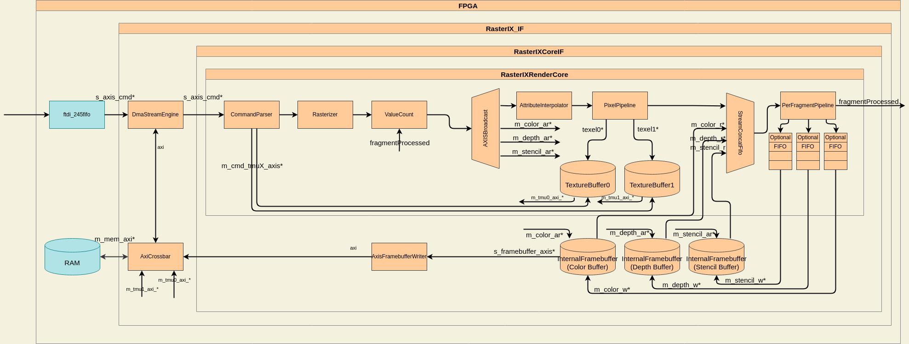
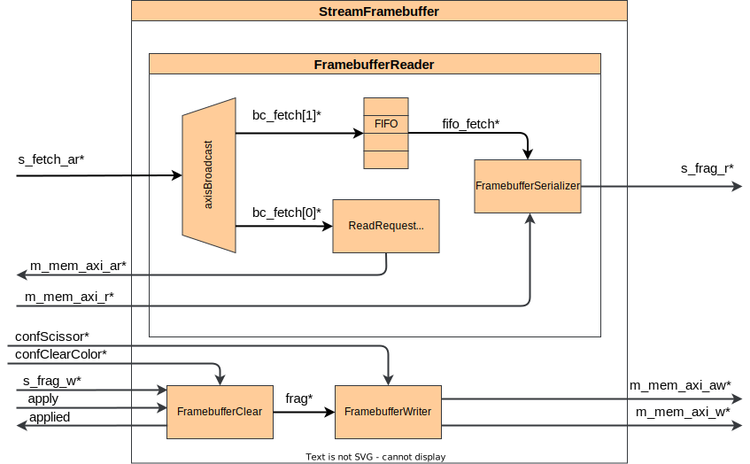

- [Design](#design)
  - [RasterixIF](#rasterixif)
  - [RasterixEF](#rasterixef)
  - [Software Flow](#software-flow)
  - [FPGA Flow](#fpga-flow)
    - [Flow Control](#flow-control)
  - [Pixel Pipeline](#pixel-pipeline)
  - [Texture Mapping Unit](#texture-mapping-unit)
  - [Per Fragment Pipeline](#per-fragment-pipeline)
  - [Stream Framebuffer](#stream-framebuffer)

# Design
For the s_cmd_axis command specification, please refer `rtl/Rasterix/RegisterAndDescriptorDefines.vh`.

The renderer uses a stream centric design. That means, the renderer does not query any data from RAM or other sources. It expects a stream of data which contains all needed data to render a triangle, like texture data, configurations, triangle parameters and so on. For that reason, the renderer has a few internal buffers:
- Texture Buffer: A buffer which holds a complete texture. Typically this is 128kB in size to contain a full 256x256x16 texture. Each TMU has their own texture buffer.
- Frame Buffer: The frame buffer used for rendering. There is a configurable 16bit color buffer, 16bit depth buffer and 4 bit stencil buffer.

## RasterixIF
When the rendering of the image is finished, the renderer will stream out the content from the internal frame buffer.

Normally the internal frame buffer in the renderer is too small to render a complete high resolution picture. To overcome this limitation, the renderer can render partial images. For instance, assume a screen resolution of 1024x768x16 (1536kB) and a internal frame buffer with the size of 256kB. The driver will then divide the image in 6 different 1024x128x16 parts. It will first render the image {(0, 0), (1023, 127)}, then {(0, 128), (1023, 255)} and so on. It will stream each subpart to the frame buffer in memory. This frame buffer is then responsible to stich the sub images together.

## RasterixEF
It uses a color buffer, depth buffer and stencil buffer on your system memory and will render there the complete image. In theory, it should be faster than the rrxif, since it needs less texture fetches. But in reality, it is slower, because the memory sub systems are usually not capable to feed the renderer fast enough and it stalls a lot of times.

## Software Flow
The following diagram shows roughly the flow a triangle takes, until it is seen on the screen.

The driver is build with the following components:
- `Application`: The application is the user of the library to draw 3D images.
- `RRXGL`: Main entrypoint of the library. Creates and initializes all necessary classes for the library.
- `VertexPipeline`: Implements the geometry transformation, clipping and lighting.
- `PixelPipeline`: Controls the pixel pipeline of the hardware.
- `Renderer`: Executes the rasterization, compiles display lists and sends them via the `IBusConnecter` to the Rasterix.
- `Rasterizer`: This basically is the rasterizer. It implements the edge equation to calculate barycentric coordinates and also calculates increments which are later used in the hardware to rasterize the triangle. This is also done for texture coordinates and w.
- `DisplayList`: Contains all render commands produced from the Renderer and buffers them, before they are streamed to the Rasterix.
- `TextureMemoryManager`: Manager for the texture memory on the device.
- `BusConnector`: This is an interface from the driver to the renderer. It is used to transfer the data via the defined interface like USB on a PC build, AXI on the Zynq build or SPI for microcontrollers.

## FPGA Flow

- `ftdi_245fifo` (3rd party): Implements the ft245 interface.
- `RasterixIF`: This is the main core. This module works as stand alone and is used to integrate into block designs or custom FPGA SoCs.
  - `DmaStreamEngine`: DMA engine to write data into the RAM, stream data from the RAM to the renderer or pass through the stream from the FTDI to the renderer.
  - `RasterixRenderCore`: This is the top module of the renderer. It contains all necessary modules to produce images.
    - `CommandParser`: Reads the data from the CMD_AXIS port, decodes the commands and controls the renderer. It also contains several control signals (not drawn for simplicity reasons) to observe the current state of the pipeline, the execution of framebuffer commands, the write channel of the fog LUT and so on.
    - `Rasterizer`: Takes the triangle parameters from the `Rasterizer` class (see the section in the Software) and rasterizes the triangle by using the precalculated values/increments.
    - `ValueTrack`: It is counting the pixels in the pipeline. This is necessary, to avoid raw (read before write) conflicts when starting to draw the new triangle while pixels from the past one are still floating around the pipeline.
    - `AXISBroadcast`: Broadcasts the stream into four independent streams to the rendering pipeline and to the three framebuffer (color, depth, stencil).
    - `AttributeInterpolator`: Interpolates the triangles attributes like color, textures and depth. Also applies the perspective correction to the textures.
    - `PixelPipeline`: Consumes the fragments from the `AttributeInterpolator`, and does the texenv calculations, texture clamping and fogging.
    - `TextureBuffer`: Buffer which contains the complete texture. One for each TMU. They are filled with data from the command parser.
    - `StreamConcatFifo`: Concatenates the pixel stream with the framebuffer stream. It only forwards a pixel if (enabled) all three framebuffers have read a fragment. Otherwise the pipeline stalls here. It does the opposite of the `AXISBroadcast`.
    - `PerFragmentPipeline`: Calculates the per fragment operations like color blending and alpha / stencil / depth tests.
    - `FrameBuffer`: Contains the color, depth and stencil buffer.

### Flow Control
The high level modules using a back pressure mechanism (valid/ready) to stall the pipeline. High level modules are considered all modules in the `RasterixRenderCore`. Other modules using a clock enable signal (ce) to stall the processing when the m_ready signal stalls.

## Pixel Pipeline

The pixel pipeline gets the data from the `AttributeInterpolator`, reads the texels with its TMUs, applies the fog and forwards the data to the `PerFragmentPipeline`.

## Texture Mapping Unit

The texture mapping unit gets the texture coordinates from the `AttributeInterpolator`. It samples the texture (a quad of four texels at once, by using the integer part of the `textureT` and `textureS` coordinates), filters the texel (by using the fraction part of `textureS` and `textureT`), and applies the texture environment calculations.

If the TMU is disabled, it doesn't forward the calculated color, instead it forwards the previous color.

- `LodCalculator`: Calculates the LOD for a texture. The texel used for the LOD calculation is the texel with the coordinates (textureS + 1, textureT + 1) in screen space.
- `TextureSampler`: Samples a texture from the `TextureBuffer`.
- `TextureFilter`: Filters the texel from the `TextureSampler`.
- `TexEnv`: Calculates the texture environment.
## Per Fragment Pipeline

The per fragment pipeline applies all tests needed for the fragment like depth test, alpha test and stencil test. It blends the fragment from the `PixelPipeline` with the color of the framebuffer and then write the data back into the framebuffer.

The `*_rdata` values are read from the framebuffer.

- `ColorBlender`: Implements the color blending modes.
- `TestFunc`: Implements the test functions for the alpha, stencil and depth test.
- `StencilOp`: Implements the stencil ops.
## Stream Framebuffer

The `StreamFramebuffer` is used from the `RasterixEF`. It operates directly on the RAM.

- `axisBroadcast`: Splits the `fetch*` data into two streams, one goes into the FIFO to be stored until the read data arrives, the other is used to create the memory requests.
- `ReadRequestGenerator`: This module creates the read requests based on the index in `fetch*` and writes it to the AXI address channel.
- `FramebufferSerializer`: Reads the data from the AXI read channel and from the FIFO. It will always receive a vector of pixels from the read channel, based on the index information in `fetch*` it will select the correct pixel from the vector and forwards it via the `m_frag_axis*` channel to the pipeline.
- `FramebufferClear`: This module is used to clear the framebuffer. It basically creates a write request for each pixel on the screen. If it is disabled, it will just forward the `frag*`. It is enabled with the apply signals.
- `FramebufferWriter`: It creates a vector of pixels (it works exactly the other way the `FramebufferSerializer` works). It executes the scissor test and writes the pixel via the AXI write channel. The vector position of the pixel and the write address is based on the index information in `frag*`.