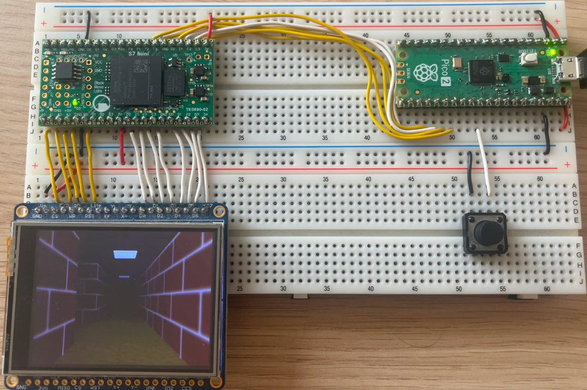

# TE0890 Build

The [TE0890](https://www.trenz-electronic.de/en/S7-Mini-Fully-Open-Source-Module-with-AMD-Spartan-7S25-1C-64-Mbit-HyperRAM/TE0890-02-P1C-5-A) is a low-cost, open-source FPGA module from Trenz Electronic GmbH. It includes 8MB of HyperRAM and an `XC7S25` FPGA, making it one of the most affordable ways to use this project with an MCU.

The FPGA connects to an MCU via an SPI interface, with an additional CTS pin for software-based flow control.

## Variant: `rixef`

- 1 TMU (max resolution: 128x128)
- Mipmap support
- Fixed-point arithmetic
- Fog
- Texture filtering
- Stencil buffering
- Depth buffering
- HyperRAM interface
- 75 MHz clock with 150 MB/s memory bandwidth 

**Note:** `glReadPixels`, `glCopyTexImage2D`, and `glCopyTexSubImage2D` are not available. The SPI MISO channel is currently unused and requires implementation.

This design uses [Michael Jørgensen's HyperRAM controller](https://github.com/MJoergen/HyperRAM). Unfortunately, the `XC7S25-1` cannot sustain the originally designed clock speed of 100 MHz, so the clock is reduced to 75 MHz. This should have no impact except for a reduction in memory bandwidth.

To build the binaries, use the following commands:

```sh
cd rtl/top/Xilinx/te0890
/Xilinx/Vivado/2022.2/bin/vivado -mode batch -source build.tcl
```

You will find `rasterix.bin` and `rasterix.bit` in the `synth` directory. To program the FPGA or flash memory, you will need a Digilent HS2 debugger or equivalent device and Vivado.

## Hardware Setup

The following hardware setup shows a Raspberry Pi Pico 2 connected to a TE0890 board and a 320x240 pixel display with an `ILI9341` chipset.

 

To connect the Pico to the FPGA, use the following pin mapping:

| Signal | Pico | TE0890 |
|--------|------|--------|
| MOSI   | GP19 | E2     |
| SCK    | GP18 | E0     |
| MISO   | GP16 | E1     |
| CSN    | GP17 | F3     |
| CTS    | GP20 | F2     |
| RSTN   | GP21 | E3     |

**Maximum supported SPI clock speed:** 18 MHz

**Note:** The SPI controller samples signals at the core clock frequency, making the bus more robust for breadboard setups. However, this approach is relatively slow. The maximum frequency is limited to core clock / 4, which in this case is 75 MHz / 4 = ~18 MHz.

The display (Adafruit 2.4" TFT LCD Breakout Board) connects directly to the FPGA via an 8080-I parallel interface. The FPGA automatically configures the display when the `RSTN` pin is asserted. Use the following pin mapping to connect the display:

| Signal   | TE0890                             | ILI9341 |
|----------|------------------------------------|---------| 
| CS       | A0                                 | CS      |
| C/D      | A1                                 | C/D     |
| WR       | A2                                 | WR      |
| RD       | A3                                 | RD      |
| RST      | B0                                 | RST     |
| DATA[7:0]| { D3, D2, D1, D0, C3, C2, C1, C0 } | D[7:0]  |
 
**Note:** Use the power from the FPGA board to power the display! 

# RPPICO Build

This build uses the [TE0890 Build](#te0890-build) and the Pico SDK. By default, the Pico SDK is downloaded automatically.

To build the RPPICO binary, open a terminal and run:

```sh
cd <rasterix_directory>
cmake --preset rppico -DPICO_BOARD=pico2
cmake --build build/rppico --config Release --parallel
```

The compiled `labyrinth.uf2` file, together with other exampels, will be located in `build/rppico/example/`.

**Note:** The RIX library makes heavy use of floating-point arithmetic. An MCU with an FPU, such as the `rp2350`, is recommended and can improve overall performance by approximately 10×.

# PlatformIO

If you are using [PlatformIO](https://platformio.org/), you can add this repository directly to your `platformio.ini` as follows:

```ini
[env:teensy40]
platform = teensy
board = teensy40
framework = arduino
lib_deps = toni3141-RasterIX=https://github.com/ToNi3141/RasterIX.git
build_flags = ${rixef.build_flags}

[rixef]
build_flags = 
    -Ofast 
    -std=c++17
    -DRIX_CORE_TMU_COUNT=1
    -DRIX_CORE_MAX_TEXTURE_SIZE=128
    -DRIX_CORE_ENABLE_MIPMAPPING=true
    -DRIX_CORE_MAX_DISPLAY_WIDTH=320
    -DRIX_CORE_MAX_DISPLAY_HEIGHT=240
    -DRIX_CORE_FRAMEBUFFER_SIZE_IN_PIXEL_LG=20
    -DRIX_CORE_ENABLE_ATTRIBUTE_SCALING=true
    -DRIX_CORE_NUMBER_OF_TEXTURE_PAGES=512
    -DRIX_CORE_NUMBER_OF_TEXTURES=128
    -DRIX_CORE_TEXTURE_PAGE_SIZE=2048
    -DRIX_CORE_GRAM_MEMORY_LOC=0x0
    -DRIX_CORE_COLOR_BUFFER_LOC_0=0x400000
    -DRIX_CORE_COLOR_BUFFER_LOC_1=0x400000
    -DRIX_CORE_COLOR_BUFFER_LOC_2=0x500800
    -DRIX_CORE_DEPTH_BUFFER_LOC=0x601000
    -DRIX_CORE_STENCIL_BUFFER_LOC=0x701800
    -DRIX_CORE_THREADED_RASTERIZATION=false
    -DRIX_CORE_THREADED_RASTERIZATION_DISPLAY_LIST_SIZE=0
    -DRIX_CORE_ENABLE_VSYNC=false
    -DRIX_CORE_MAX_VBO_COUNT=256
    -DRIX_CORE_AUTOLOAD_INTERNAL_FRAMEBUFFER=false
    -DRIX_CORE_SOFTWARE_RENDERING=false
```

An example for the Arduino framework is available in the `examples` directory.

# Memory Layout

```
0x00'0000 +-----------------------+
     1 MB | Texture Memory        |
0x10'0000 |-----------------------|
     3 MB | Free                  |
0x40'0000 |-----------------------|
     1 MB | Color Buffer 0/1      |
0x50'0000 |-----------------------|
     1 MB | Color Buffer 2        |
0x60'0000 |-----------------------|
     1 MB | Depth Buffer          |
0x70'0000 |-----------------------|
     1 MB | Stencil Buffer        |
0x80'0000 +-----------------------+
```

**Note:** It is beneficial to offset buffer addresses by 512 B to 8 KB, which improves memory subsystem performance by ensuring each buffer accesses a different bank, potentially reducing RAS latency. This optimization provides noticeable benefits for SDRAM and DDR memory, though the impact on HyperRAM may be minimal.

The design uses only 1 MB of texture memory to conserve MCU memory, as increased memory usage can expand the page tables.